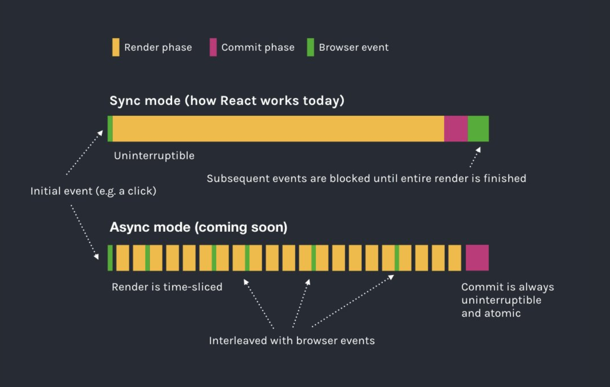
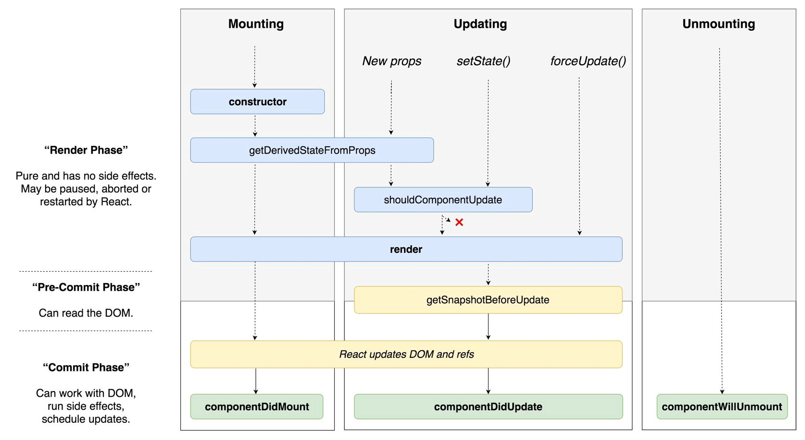

# React Suspense and Concurrent Mode

## Code Splitting

* Bundling your application is great, but as your app grows, your bundle size will grow too, especially if you include large 3rd party libraries
* This may have a huge impact on the time to first load and UX, especially on slow networks
* The bundle can be split into smaller chunks where the most important ones can be loaded first and then every other secondary are lazily loaded - **code splitting**

### What Is Code Splitting

* Multiple bundles are created that are loaded dynamically, only at the time they are needed
* Can significantly improve performance of your app

### React.lazy

* lazy() is a function that Returns component - it enables you to render a dynamic import
* Will automagically download the bundle with component at the moment it is required to render

#### Standard Import

```javascript
import ContactDetails from './contactDetails';
```

#### Dynamic Import Syntax

* Import that returns promise
* If you're using **Create React App**, then this is enabled by default
* Otherwise it has to be configured in Webpack

```javascript
import('./contactDetails').then({ContactDetails} => {
  // component loaded and available here
});
```

#### React.lazy()

* It's first and only argument takes a function that returns dynamic import

```javascript
import {React, lazy} from 'react';
const ContactDetails = lazy(
  () => import('./contactDetails')
);

const MyComponent = () => (
  <div>
    <h1>Lazy Loaded Component:</h1>
    <ContactDetails />
  </div>
);
```

* Using lazy loaded component on its own **will throw an error**, we have to wrap it in `Suspense` component

### Suspense

* Suspense is a React component that displays fallback content (e.g. spinner) while waiting for the dynamic content to load
* Fallback can be any valid react component

```javascript
import {React, lazy, Suspense} from 'react'
const ContactDetails = lazy(() => import('./contactDetails'));

const MyComponent = () => (
  <div>
    <Suspense fallback={<div>Lazy loaded component is on it's way...</div>}>
      <ContactDetails />
    </Suspense>
  </div>
);
```

* We can (and must) place the `Suspense` anywhere above the lazy loaded component, but despite that we can use the component the same way we use standard components
* It doesn't matter how deep the lazy loaded component is nested, it works similar to try-catch syntax - first Suspense component up in the component tree will catch the dynamic content and display fallback
* We can wrap multiple lazy components inside a single `Suspense` component => it will display fallback until all nested dynamic components are loaded. That's convenient e.g. to **avoid multiple spinners next to each other**

```javascript
import {React, lazy, Suspense} from 'react'
const ContactDetails = lazy(() => import('./contactDetails'));
const FeedbackForm = lazy(() => import('./feedbackForm'));

const MyComponent = () => (
  <div>
    <Suspense fallback={<div>Lazy loaded component is on it's way...</div>}>
      <ContactDetails />
      <div>
        <div>What do you think about our app?</div>
        <FeedbackForm />
      </div>
    </Suspense>
  </div>
);
```

### Notes

* React.lazy supports only default exports, if you want to use named exports, you must use intermediate module that reexports it as the default
* lazy() and Suspense is [not yet available for server-side rendering](https://reactjs.org/docs/code-splitting.html#reactlazy)
* Replaces [react loadable](https://github.com/jamiebuilds/react-loadable) - no new idea, just internalized and easy to use

### Route Based Code Splitting

Good place to start with code splitting is with individual Routes - it makes sense to load only pages your user visits.

```javascript
import { BrowserRouter as Router, Route, Switch } from 'react-router-dom';
import React, { Suspense, lazy } from 'react';

const Home = lazy(() => import('./pages/Home'));
const About = lazy(() => import('./pages/About'));

const App = () => (
  <Router>
    <Suspense fallback={<div>Loading the page...</div>}>
      <Switch>
        <Route exact path="/" component={Home}/>
        <Route path="/about" component={About}/>
      </Switch>
    </Suspense>
  </Router>
);
```

> Exercise 1 => [Use Suspense with lazy()](./exercise-lazy/src/App.js)

***
**What we've gone through until now is in the production, from now on we will talk about the future**
***

### Suspense For Data Fetching

* Planned in the near future (mid 2019), now **experimental** package `react-cache`
* Eventually most data fetching should happen through Suspense but it will take a long time until all integrations are ready for that

### How To Use

First, a resource needs to be created (which is basically an object that has a `read()` method. This method takes key as its only parameter - key for the hash map).

We can implement e.g. component for image loading:

```javascript
import React, {Suspense} from 'react';
import {unstable_createResource as createResource} from 'react-cache';

const ImageResource = createResource(src => new Promise(resolve => {
  // Creates an image object and resolves a promise once the image loads
  const img = new Image();
  img.onload = () => resolve(src);
  img.src = src;
}));

const Img = ({src, alt, ...props}) => {
  // if no image with given source is found in the resource (cache), this line will throw a promise:
  const url = ImageResource.read(src);

  // When the promise is resolved, the component's render will be called again and
  // this time ImageResource.read(src) will not throw (resource is already cached)
  // and component will be rendered
  return ;
};
```

And use `Img` component inside `Suspense` as simply as:

```xml
<Suspense fallback={<div>I am downloading the image...</div>}>
  
</Suspense>
```

* React.Suspense has a componentDidCatch sort of mechanism which will catch the promise thrown by `ImageResource.read()` and show a fallback until the promise is resolved.  
* It's easy to extend this code to include an API call to fetch URL of some image before downloading it, let's try it:

> Exercise 2 => [Use Suspense with data fetch and images](./exercise-fetch/src/pages/kitties.jsx)

## Concurrent Mode (Asynchronous Rendering)

"Concurrent Mode lets React apps be more responsive by rendering component trees without blocking the main thread." - Dan Abramov


> [Source: Andrew Clark's twitter post](https://twitter.com/acdlite/status/977291318324948992)

* Formerly known as "Async mode", but "Concurrent mode" name has been chosen eventually because it reflects more the ability to perform work on different priority levels
* Allows React to interrupt a long-running render (for example, rendering a new feed story) to handle a high-priority event (for example, text input or hover)
* Keeps your app responsive while rendering complex component trees
* Allows Suspense to skip unnecessary loading states on fast connections (flashing spinners)
* Concurrent mode is the future of React, but so far only in experimental state.
* In Road map planned for Q2 2019
* No documentation yet

If you want to know more about how the concurrent mode is implemented, check out `fiber` and `algebraic effects`

### Enabling The Concurrent Mode

Instead of

```javascript
ReactDOM.render(<App />, document.getElementById('root'));
```

simply use:

```javascript
ReactDOM
  .createRoot(document.getElementById('root'))
  .render(<App />);
```

This will allow to use new features, e.g. maxDuration prop of Suspense - it defines the time in ms after which our fallback component will show up. This will avoid screen flickering issue which usually occurs on faster network where the loader shows up for few ms and then the data comes immediately.

### Important Changes In React With Concurrent Mode

As render can be called multiple times in Concurrent Mode, some methods are no longer safe to use. Wrap your application in `<React.StrictMode>` to reveal potential problems - [see more here](https://reactjs.org/docs/strict-mode.html#identifying-unsafe-lifecycles)

Following lifecycle methods will be deprecated in future:

* `componentWillMount`
* `componentWillReceiveProps`
* `componentWillUpdate`

Two new lifecycle methods will be added as a replacement:

* `getSnapshotBeforeUpdate`
* `getDerivedStateFromProps`


> [Source: Dan Abramov's twitter post](https://twitter.com/dan_abramov/status/981712092611989509/photo/1)

***It's crucial to have your render methods/functions pure, without any side effects!***

## Sources and Further Reading

### Talks

* [Andrew Clark's talk on React Suspense](https://www.youtube.com/watch?v=z-6JC0_cOns)
* [Dan Abramov's talk on React Suspense](https://www.youtube.com/watch?v=6g3g0Q_XVb4) from ReactFest
* [Jared Palmer's talk on React Suspense](https://www.youtube.com/watch?v=SCQgE4mTnjU) from React Conf 2018
* [Talk of Andrew Clark and Brian Vaughn on Concurrent Rendering in React](https://www.youtube.com/watch?v=ByBPyMBTzM0) from React Conf 2018

### Articles And Documentation

* [Code Splitting the React app - official documentation]([https://reactjs.org/docs/hooks-intro.html](https://reactjs.org/docs/code-splitting.html))
* [Marvin Frachet - React-cache, time slicing, and fetching with a synchronous API](https://medium.freecodecamp.org/react-cache-time-slicing-and-fetching-with-a-synchronous-api-2a57dc9c2e6d) => advanced reading on how is the concurrent mode implemented